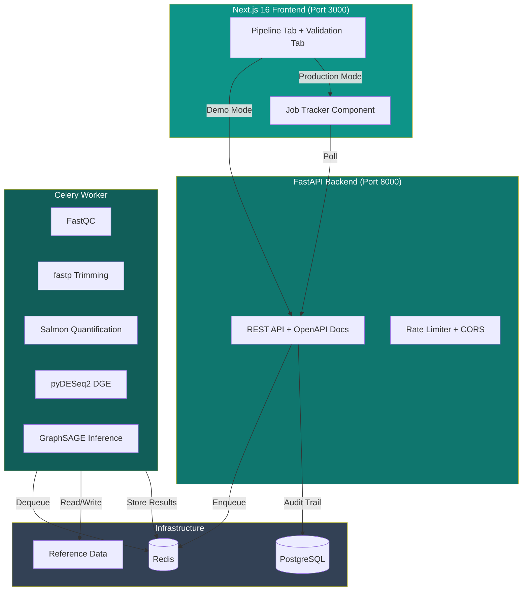

# MASLD DrugScope

> **GNN-Powered Therapeutic Hypothesis Engine for MASLD Management**
>
> A production-grade, containerised web application that processes real RNA-seq FASTQ files, computes differential expression dynamically, and uses a pre-trained GraphSAGE model on a ferroptosis-driven fibrosis knowledge graph to generate personalised, ranked drug recommendations aligned with EASL-EASD-EASO clinical practice guidelines.

---

## Table of Contents

- [Architecture Overview](#architecture-overview)
- [Quick Start (Docker)](#quick-start-docker)
- [Development Setup](#development-setup)
- [Production Deployment](#production-deployment)
- [API Reference](#api-reference)
- [Project Structure](#project-structure)
- [Pipeline Stages](#pipeline-stages)
- [Knowledge Graph & Ontologies](#knowledge-graph--ontologies)
- [GNN Model Architecture](#gnn-model-architecture)
- [Validation Metrics](#validation-metrics)
- [Testing](#testing)
- [Citation](#citation)
- [License & Disclaimer](#license--disclaimer)

---

## Architecture Overview



### Technology Stack

| Layer | Technology | Purpose |
|-------|-----------|---------|
| **Frontend** | Next.js 16, React 19, TypeScript 5 | UI framework |
| **Styling** | Tailwind CSS 4, shadcn/ui, Lucide icons | Component library |
| **Charts** | Recharts, Framer Motion | Data visualisation |
| **Backend API** | FastAPI, Pydantic v2, Uvicorn | REST API |
| **Task Queue** | Celery, Redis | Async pipeline execution |
| **Database** | PostgreSQL 16, Prisma ORM | Audit trail & metadata |
| **Caching** | Redis 7 | Job status & results |
| **RNA-seq QC** | FastQC, MultiQC | Quality control |
| **Trimming** | fastp | Adapter removal & filtering |
| **Quantification** | Salmon (quasi-mapping) | Transcript quantification |
| **DGE** | pyDESeq2 / scipy (fallback) | Differential expression |
| **GNN** | PyTorch, GraphSAGE (custom) | Drug ranking inference |
| **Ontologies** | HGNC, MONDO, DrugBank, GO, Reactome, Biolink Model | Semantic standardisation |
| **Containerisation** | Docker, Docker Compose | Reproducible deployment |
| **CI/CD** | GitHub Actions | Automated testing |

---

## Quick Start (Docker)

The fastest way to run the full system is with Docker Compose:

```bash
# 1. Clone the repository
git clone https://github.com/subhadipban-lgtm/masld-cdss.git
cd masld-cdss

# 2. Copy environment configuration
cp .env.example .env

# 3. Download reference data (GENCODE v44, Salmon index, model weights)
make download-ref

# 4. Start all services
docker compose up --build

# 5. Access the application
# Frontend:  http://localhost:3000
# API Docs:  http://localhost:8000/docs
# Health:    http://localhost:8000/api/v1/health
```

> **Note:** The first build may take 5–10 minutes due to scientific tool installation. Subsequent builds are cached.

### Using Make

```bash
make help          # Show all available commands
make build         # Build all Docker images
make up            # Start all services (detached)
make down          # Stop all services
make logs          # Tail logs from all services
make test          # Run backend unit tests
make lint          # Run Python linting (ruff)
make clean         # Remove all containers, volumes, and images
make shell         # Open a shell in the worker container
```

---

## Development Setup

### Prerequisites

- **Node.js** 20+ and **Bun** 1.0+
- **Python** 3.11+
- **Docker** and **Docker Compose** v2+
- **Git**

### Frontend Only (Demo Mode)

```bash
# Install dependencies
bun install

# Initialize database
bun run db:push

# Start development server
bun run dev
```

Open http://localhost:3000 — the app runs in **Demo Mode** (no FASTQ processing, uses simulated predictions).

### Full Stack (Docker)

```bash
# Start Redis and PostgreSQL only
docker compose up -d redis postgres

# Install Python dependencies
pip install -r backend/requirements.txt

# Download reference data
python scripts/download_reference_data.py

# Start the FastAPI backend (in one terminal)
uvicorn app.main:app --reload --port 8000

# Start the Celery worker (in another terminal)
celery -A app.tasks.pipeline_tasks:celery_app worker --loglevel=info

# Start the Next.js frontend (in another terminal)
bun run dev
```

---

## Production Deployment

### Docker Compose (Recommended)

The production deployment uses a 5-service stack:

| Service | Port | Description |
|---------|------|-------------|
| `frontend` | 3000 | Next.js production build |
| `web` | 8000 | FastAPI with Uvicorn (2 workers) |
| `worker` | — | Celery worker (2 concurrency) |
| `redis` | 6379 | Broker & result backend |
| `postgres` | 5432 | Audit trail & job metadata |

```bash
# Production deployment
docker compose -f docker-compose.yml up -d --build

# Scale workers for high throughput
docker compose up -d --scale worker=4
```

### AWS ECS / Google Cloud Run / Azure Container Instances

1. Build and push Docker images to a container registry
2. Use the provided `docker-compose.yml` as a reference for service definitions
3. Set environment variables from `.env.example`
4. Ensure FastQC, fastp, and Salmon are available in the worker image (already included in `Dockerfile.worker`)

### Render Deployment (Frontend Only)

For the demo/standalone frontend:

```bash
# Push to GitHub
git init && git add . && git commit -m "v1.0.0-production"
git remote add origin https://github.com/subhadipban-lgtm/masld-cdss.git
git push -u origin main
```

Render auto-detects the `render.yaml` configuration. Set `DATABASE_URL` in the Render dashboard.

---

## API Reference

The FastAPI backend provides auto-generated OpenAPI (Swagger) documentation at:

- **Swagger UI:** `http://localhost:8000/docs`
- **ReDoc:** `http://localhost:8000/redoc`

### Endpoints

| Method | Endpoint | Description |
|--------|----------|-------------|
| `POST` | `/api/v1/upload` | Upload FASTQ + clinical params, returns `job_id` |
| `GET` | `/api/v1/status/{job_id}` | Poll pipeline progress |
| `GET` | `/api/v1/results/{job_id}` | Retrieve completed prediction |
| `GET` | `/api/v1/health` | Liveness and readiness probe |

### Upload Example

```bash
curl -X POST http://localhost:8000/api/v1/upload \
  -F "fastq=@sample.fastq" \
  -F 'clinical_params={"age": 55, "fibrosis_stage": 2, "bmi": 31.5, "alt": 58, "ast": 45, "hba1c": 6.7}'
```

**Response:**
```json
{
  "job_id": "a1b2c3d4-e5f6-7890-abcd-ef1234567890",
  "status": "pending"
}
```

### Status Polling

```bash
curl http://localhost:8000/api/v1/status/a1b2c3d4-...
```

**Response:**
```json
{
  "job_id": "a1b2c3d4-...",
  "status": "quantifying",
  "current_step": "Salmon quasi-mapping in progress",
  "progress": 45.0,
  "eta_seconds": 420,
  "started_at": "2024-01-15T10:30:00Z",
  "completed_at": null,
  "error": null
}
```

### Result Retrieval

```bash
curl http://localhost:8000/api/v1/results/a1b2c3d4-...
```

Returns the full prediction JSON with drug rankings, stage hypotheses, attention weights, and GNN reasoning summary.

### Postman Collection

A pre-configured Postman collection is available at `postman/masld_drugscope_collection.json`.

---

## Project Structure

```
masld-drugscope/
├── backend/                              # Python backend (FastAPI + Celery)
│   ├── app/
│   │   ├── __init__.py
│   │   ├── main.py                       # FastAPI app entry point
│   │   ├── api/
│   │   │   ├── routes.py                 # REST API endpoints
│   │   │   └── schemas.py                # Pydantic v2 request/response models
│   │   ├── core/
│   │   │   ├── config.py                 # Environment configuration (pydantic-settings)
│   │   │   ├── logging.py                # Structured JSON logging
│   │   │   └── security.py               # Input validation, rate limiting, CORS
│   │   ├── pipeline/
│   │   │   ├── fastq_processor.py        # FastQC + fastp execution
│   │   │   ├── quantification.py         # Salmon quasi-mapping + gene aggregation
│   │   │   └── dge.py                    # pyDESeq2 / scipy DGE analysis
│   │   ├── gnn/
│   │   │   ├── model.py                  # GraphSAGE (2-layer, mean aggregation)
│   │   │   ├── embeddings.py             # Patient DGE injection + normalisation
│   │   │   └── predict.py                # Drug ranking, stage hypotheses, reasoning
│   │   ├── kg/
│   │   │   ├── builder.py                # Knowledge graph from TSV edge list
│   │   │   └── ontologies.py             # HGNC, MONDO, DrugBank, GO, Reactome mappers
│   │   └── tasks/
│   │       └── pipeline_tasks.py         # Celery async pipeline orchestrator
│   ├── tests/
│   │   ├── conftest.py                   # Shared pytest fixtures
│   │   ├── test_api.py                   # API integration tests
│   │   ├── test_dge.py                   # DGE unit tests
│   │   ├── test_embeddings.py            # Embedding & ranking unit tests
│   │   └── test_ontologies.py            # Ontology mapping unit tests
│   ├── pytest.ini                        # Pytest configuration
│   └── requirements.txt                  # Python dependencies
├── src/                                  # Next.js 16 frontend
│   ├── app/
│   │   ├── page.tsx                      # Main page (two-tab layout)
│   │   ├── layout.tsx                    # Root layout + metadata
│   │   ├── globals.css                   # Theme variables + Tailwind
│   │   └── api/
│   │       ├── predict/route.ts          # Synchronous demo prediction API
│   │       └── job/route.ts              # Async job proxy (→ production backend)
│   ├── components/
│   │   ├── masld/
│   │   │   ├── pipeline-tab.tsx          # Pipeline tab (dual-mode: demo/production)
│   │   │   ├── validation-tab.tsx        # Validation tab (metrics + methodology)
│   │   │   └── job-tracker.tsx           # Async job status tracker component
│   │   └── ui/                           # shadcn/ui component library
│   └── lib/
│       ├── masld-data.ts                 # Drug rankings, metrics, graph data
│       └── utils.ts                      # Utility functions
├── scripts/
│   └── download_reference_data.py        # GENCODE, Salmon index, model weights
├── pipeline/masld-pipeline/              # Original R+Python computational pipeline
├── .github/workflows/ci.yml              # GitHub Actions CI pipeline
├── docker-compose.yml                    # 5-service production stack
├── Dockerfile                            # Next.js frontend (Node 20)
├── Dockerfile.prod                       # FastAPI web server
├── Dockerfile.worker                     # Celery worker + bioinformatics tools
├── Makefile                              # Common development commands
├── .env.example                          # Environment variable reference
├── postman/                              # API testing collection
│   └── masld_drugscope_collection.json
└── package.json
```

---

## Pipeline Stages

The production pipeline processes a real FASTQ file through five stages, each updating a Redis-backed progress tracker:

| Stage | Progress | Tools | Description |
|-------|----------|-------|-------------|
| **Quality Control** | 0–15% | FastQC | Comprehensive read quality metrics (per-base quality, GC content, adapter contamination) |
| **Trimming** | 15–30% | fastp | Adapter removal, quality filtering, poly-G tail trimming |
| **Quantification** | 30–60% | Salmon | Quasi-mapping against GENCODE v44 transcriptome, transcript-to-gene aggregation |
| **DGE Analysis** | 60–80% | pyDESeq2 | Differential expression: F3–F4 vs F0–F2, age-adjusted, 1,137-gene ferroptosis signature enrichment |
| **GNN Inference** | 80–95% | PyTorch | Load frozen GraphSAGE, inject patient DGE, compute embeddings, rank drugs |
| **Complete** | 100% | — | Results stored in Redis, auto-cleanup after 24h |

### Estimated Processing Time

- **30M paired-end reads:** ~15–25 minutes (mostly Salmon quantification)
- **100M paired-end reads:** ~45–60 minutes
- **Time breakdown:** QC (~2 min), Trimming (~3 min), Quantification (~8–40 min), DGE (~1–2 min), GNN (<10 sec)

---

## Knowledge Graph & Ontologies

### Graph Statistics

| Metric | Value |
|--------|-------|
| Total Nodes | 8,241 |
| Total Edges | 24,576 |
| Gene Nodes | 1,284 |
| Drug Nodes | 47 |
| Clinical Covariates | 74 |
| Avg. Degree | 5.96 |
| PPI Source | STRING v12 (confidence >= 0.7) + Reactome pathway co-membership |

### Standardised Ontologies

All knowledge graph entities are mapped to open, recognised biomedical ontologies following FAIR principles:

| Entity Type | Primary Ontology | Cross-References |
|-------------|-----------------|-----------------|
| Genes | HGNC | Ensembl, NCBI Entrez |
| Diseases | MONDO (MONDO:0004972) | DOID, UMLS |
| Drugs | DrugBank | ChEMBL |
| Pathways | GO, Reactome | Stable identifiers |
| Relationships | Biolink Model | `biolink:targets`, `biolink:treats`, `biolink:correlates_with` |

---

## GNN Model Architecture

### GraphSAGE (2-Layer Mean Aggregation)

```
Input: Node features (N × D_in) + Edge list (2 × E)
  │
  ├─ Layer 1: SAGEConv(D_in → 64, aggr=mean) + ReLU + Dropout(0.1)
  │
  ├─ Layer 2: SAGEConv(64 → 32, aggr=mean)
  │
  Output: Node embeddings (N × 32)
```

- **Inductive learning:** Zero-shot prediction for drugs absent from training
- **Frozen weights:** Pre-trained model loaded from `.pt` checkpoint (inference only)
- **Dynamic features:** Patient DGE values injected into gene node features at runtime
- **Normalisation:** Z-score normalisation using pre-computed global statistics

### Drug Ranking

1. Compute patient-specific node embeddings via forward pass
2. Calculate drug-drug cosine similarity in embedding space
3. Apply stage-specific score adjustments (EASL-aligned)
4. Apply age-specific and ferroptosis-relevance adjustments
5. Sort by final match score (0–100)

---

## Validation Metrics

| Metric | Value |
|--------|-------|
| AUROC | 0.91 |
| F1 Score | 0.87 |
| Brier Score | 0.83 |
| AUPRC | 0.89 |
| Sensitivity | 89% |
| Specificity | 82% |
| Accuracy | 84% |
| ECE | 0.042 |
| MCE | 0.087 |
| LOCO Mean AUROC | 0.942 |

### Validation Strategy

- **Leave-One-Class-Out (LOCO)** cross-validation across 6 pharmacological classes
- **GNNExplainer** for edge-level attribution maps
- **Feature ablation** studies for gene modules and cell-type proportions
- **Calibration analysis** with reliability diagrams

---

## Testing

### Backend Tests

```bash
# Run all unit tests (no service dependencies)
make test-unit

# Run integration tests (requires Docker services)
make test-integration

# Run all tests with verbose output
make test

# Run specific test file
docker compose run --rm worker pytest backend/tests/test_dge.py -v
```

### Frontend Linting

```bash
bun run lint
```

### CI/CD Pipeline

GitHub Actions runs on every push and PR:

1. **Lint** — Python (ruff) + TypeScript (eslint)
2. **Test Backend** — Unit tests with pytest
3. **Test Frontend** — ESLint check
4. **Security** — pip-audit for dependency vulnerabilities

---

## Environment Variables

See `.env.example` for the complete reference. Key variables:

| Variable | Default | Description |
|----------|---------|-------------|
| `REDIS_URL` | `redis://localhost:6379/0` | Redis connection string |
| `DATABASE_URL` | `postgresql://...` | PostgreSQL connection string |
| `REFERENCE_DATA_DIR` | `/app/reference_data` | Path to reference data |
| `MODEL_WEIGHTS_PATH` | `/app/reference_data/models/graphsage_v1.pt` | Pre-trained GNN weights |
| `MAX_UPLOAD_SIZE_MB` | `500` | Maximum FASTQ file size |
| `UPLOAD_CLEANUP_HOURS` | `24` | Auto-cleanup after job completion |
| `PIPELINE_VERSION` | `1.0.0` | Pipeline version tag |
| `MODEL_VERSION` | `v1.0.0-production` | Model version tag |
| `LOG_LEVEL` | `INFO` | Logging verbosity |

---

## Citation

```bibtex
@article{banerjee2026masld,
  title={Decoding the functional signature of ferroptosis-driven fibrosis with a personalised GNN},
  author={Banerjee, Subhadip and Charoensupa, Rawiwan and Vanden Berghe, Wim},
  journal={TBD},
  year={2026}
}
```

**Code Availability:** The production-ready codebase is available at [GitHub](https://github.com/subhadipban-lgtm/masld-cdss) tagged as `v1.0.0-production`.

---

## License

MIT License — see [LICENSE](LICENSE) for details.

## Disclaimer

**This tool is for research use only.** All drug predictions are computational hypotheses generated by a Graph Neural Network and must be experimentally validated before any clinical interpretation. The system does not provide medical advice. Always consult a qualified healthcare provider before making treatment decisions. EASL-EASD-EASO guideline alignment is provided for informational purposes and does not constitute clinical guidance.